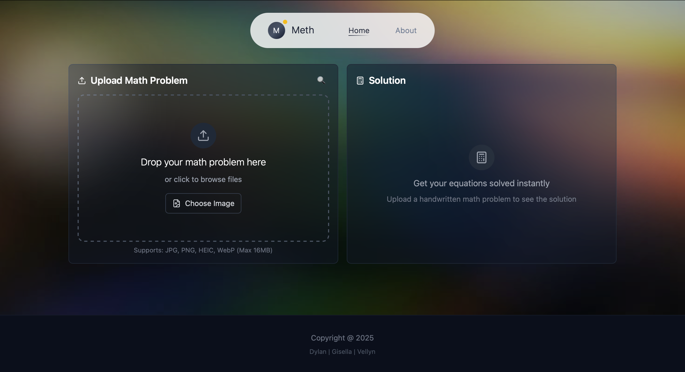

Meth is a handwritten math-solver that uses a Convolutional Neural Network (CNN) to recognize and solve math problems from uploaded images.

## Documentations

Upload your handwritten math problems, and get immediate answers

Processing Steps

